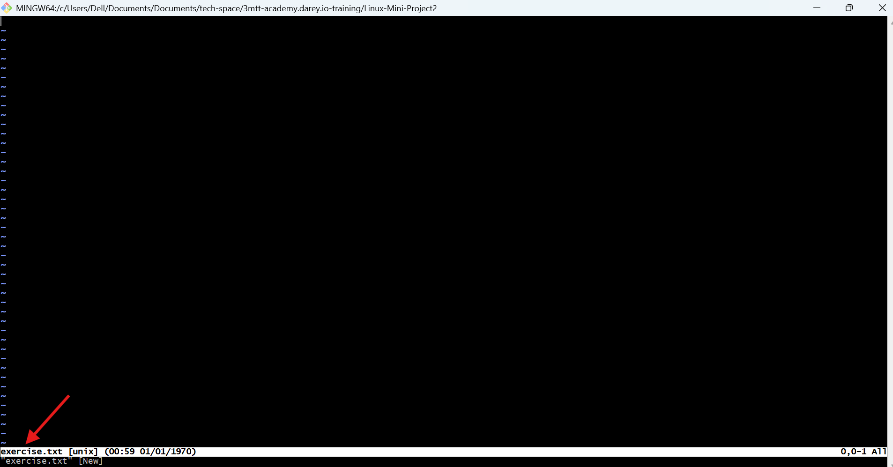
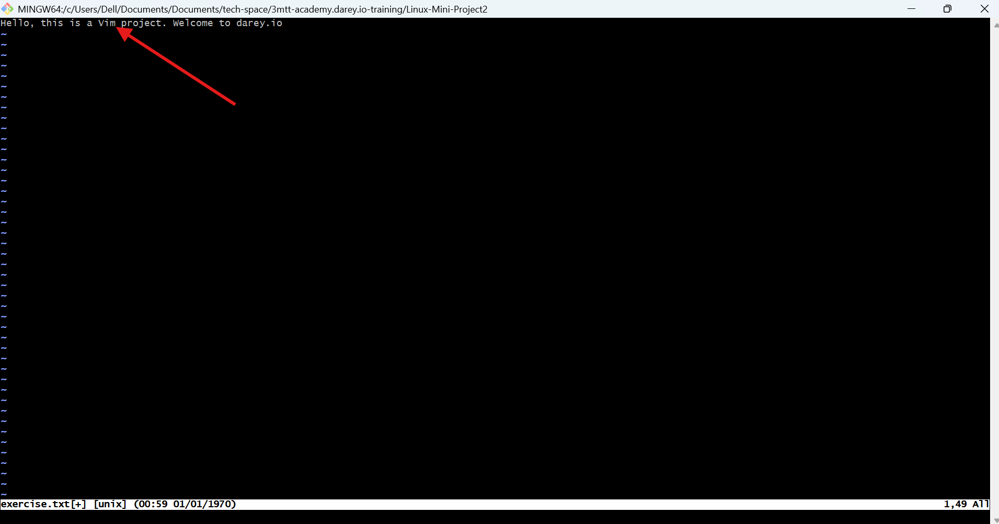
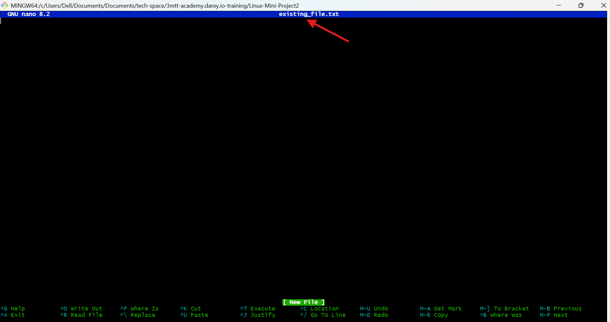
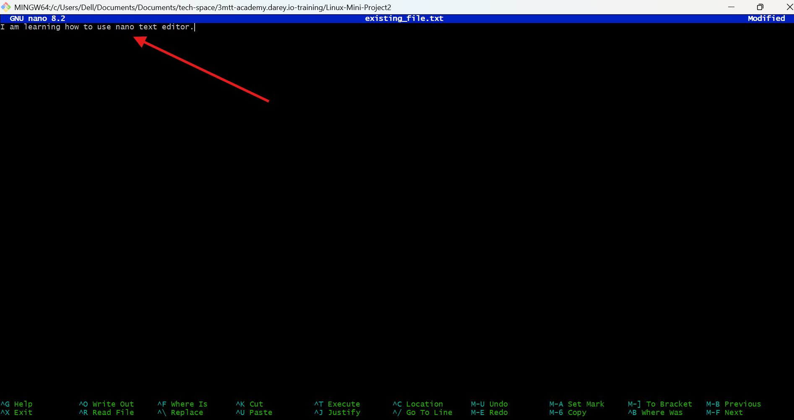

# Linux Text Editors Project

##   Introduction to Linux Text Editors

A Linux text editor is a software application designed for creating, modifying, and managing text files on a Linux-based system. Text editors play a crucial role in the Linux environment, providing a means for users to interact with and manipulate plain text files, configuration files, scripts, and other text-based documents.
There are various text editors available in the Linux ecosystem, each with its own set of features and user interface.

##  1. Introduction to Vim Text Editor

The Linux Vim text editor, short for "Vi Improved," is a powerful and versatile text editing tool deeply ingrained in the Unix and Linux ecosystems. Vim builds on the original Vi editor, offering an extensive set of features, modes, and commands that empower users to manipulate text efficiently. While Vim has a steeper learning curve compared to simpler editors like Nano, its capabilities make it a favorite among tech professionals and anyone working extensively with text files.

### Working With Vim Editor
  - Command: `vim exercise.txt`
  - Explanation: This command creates a file named `exercise.txt` even if it doesn't exist. It creates and opens it for editing, similar to opening a Notepad file on Windows.

### Basic Vim Operations

- **Enter Insert Mode to Edit the File:**
  - Action: Press `i` to enter Insert mode.
  - Text to Type: `Hello, this is a Vim project. Welcome to darey.io.`

- **Moving Around:**
  - Action: Navigate through the text using arrow keys or `h` (left), `j` (down), `k` (up), and `l` (right).
- **Deleting a Character:**
  - Action: Press `Esc` to exit Insert mode, position the cursor on a character you want to delete, and press `x`.
- **Deleting a Line:**
  - Action: Ensure you are not in Insert mode (press `Esc` if needed), place the cursor on a line, and press `d` twice (`dd`) to delete the entire line.
- **Undoing Changes:**
  - Action: Make a change (add or delete text) in Insert or Normal Mode, then press `Esc` to enter Normal Mode and press `u` to undo the last change.
- **Saving Changes:**
  - Action: After finishing writing, press `Esc`, then type `:wq` and press `Enter` to save the file. (`w` means write and `q` means quit, exiting Vim mode and returning to the terminal.)
- **Quitting Without Saving:**
  - Action: If you do not intend to save the file, press `Esc`, then type `:q!` and press `Enter` to quit without saving changes.

## 2.  Nano Text Editor

Among Linux text editors, Nano stands out as a user-friendly and straightforward tool, making it an excellent choice for users new to the command line or those preferring a more intuitive editing experience. Nano serves as a versatile and lightweight text editor, ideal for various tasks.

### Working with Nano Editor

Nano's intuitive command set simplifies text manipulation tasks, allowing users to navigate through files, insert or delete text, and save changes effortlessly. Nano's ease of use extends to its keyboard shortcuts, making it accessible even to those unfamiliar with intricate command sequences. This makes it a go-to choice for beginners to experienced Linux enthusiasts.
- **Working With Nano Editor:**
  - Command: `nano existing_file.txt`
  - Explanation: This command opens a new file named `existing_file.txt`, and you will enter the Nano editor interface.

### Nano Operations

- **Enter an existing or new file  and Editing Text:**
  
  - Action: Type a few lines of text into the file. Nano has a simple interface, and you can start typing immediately.
  

- **Saving Changes:**
  - Action: Save your changes by pressing `Ctrl + O`. Nano will prompt you to confirm the filename; press `Enter` to confirm.
- **Exiting Nano :**
  - Action: If you wish to exit Nano without saving the file, simply press `Ctrl + X`. If you have unsaved changes, Nano will prompt you to save before exiting.
- **Opening an Existing File:**
  - Command: `nano existing_file.txt` (if available)
  - Explanation: Open an existing file using this command.
- **Navigation:**
  - Action: Navigate through the file using arrow keys. Write data, then save the file content.